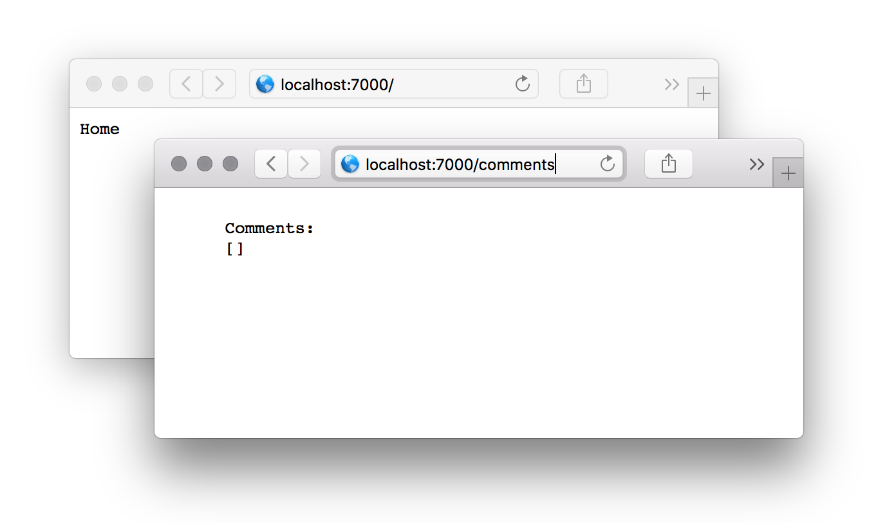
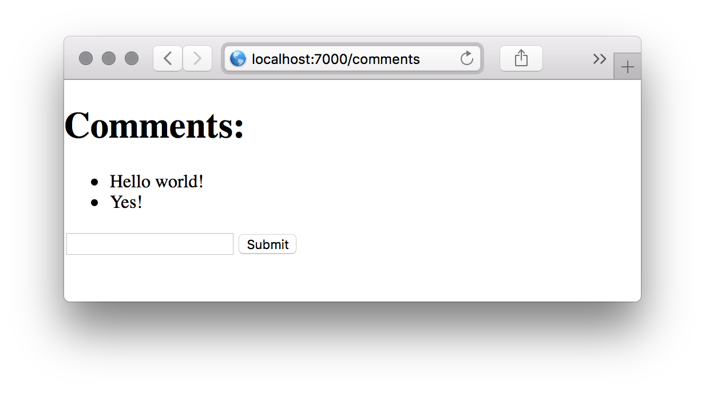
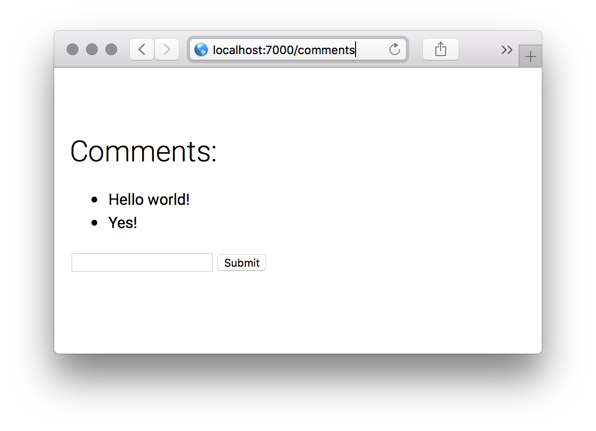

# Using React.js as a view engine in Koa

One key advantage of using React.js versus string-based template engines, is that React.js allows us to write view logic in a declarative way, instead of just doing string replacement.

Using a common JavaScript syntax and the paradigm behind "components" in React.js makes web development an interesting engineering discipline. Furthermore, having the ability to pre-process the view's source-code allows us to run some optimizations, ensure cross-compatibility and enjoy the advanced features of JavaScript.

The biggest problem with developing JavaScript-based webpages, is the huge size of the bundled (pre-compiled) file required to generate the final view. Even utilising the pre-processing optimizations is not sufficient as the source-code starts to get larger in size.

There are a number of possible solutions to help deal with this problem. The most complex ones allow the code to be required dynamically, so the initial bundled source-code is small ([Webpack's require.resolveWeak feature](https://webpack.js.org/api/module-methods/#require-resolveweak)). However Webpack easily becomes hard to maintain, optimize and understand.

In the following blogpost we explore some alternative solutions, and show how we structured [tokenfoundry.com](https://tokenfoundry.com).

## Alternative solutions

### [create-react-app](https://github.com/facebook/create-react-app)

The simplest and most common way to begin creating a React.js application is using [create-react-app](https://github.com/facebook/create-react-app). If the app is more complex, you can build on this framework and use a state-management library like [Redux](https://redux.js.org/) or [MobX](https://github.com/mobxjs/mobx) (or the new [context api](https://medium.com/dailyjs/reacts-%EF%B8%8F-new-context-api-70c9fe01596b)) and a routing solution like [React-Router](https://github.com/ReactTraining/react-router).

This approach is sufficient for apps with a small number of views, however when they start having more features, permissions and dependencies, the following issues start to arise:

* The `bundle.js` file becomes large (over 3MB).
* If using Redux, the boilerplate code for actions, reducers and containers gets larger, complex, and hard to maintain.
* The routing, session and permission management can become messy.
  * You must to check and maintain consistency of what the user can view and access. Furthermore, you must also remember to handle every possible error in the browser.
* Lack of server-side rendering leads to longer load times and worst SEO positioning.

### [Gatsby.js](http://gatsbyjs.org/)

This framework is awesome. It comes with a large number of useful plug-ins, and the final code is well optimized, split per page, pre-rendered to HTML (for initial loads), and does not require a live server (just static hosting).

Despite this, Gatsby.js [is not suited for very dynamic webpages](https://github.com/gatsbyjs/gatsby/issues/1538). Yes you can generate "dynamic" routes, but adding new routes requires the app to be rebuilt. You also still have Redux boilerplates all over your application.

### Not using React at all

How about getting rid of Redux completely? Furthermore, you can then also get rid of the complex session and permission management from the browser, and do that job back in the server. The database (the **real** single-source of truth - not Redux) is left close to your web application, everything is hidden by default and you have control over what you send to display in the browser. We have been doing server-side rendering for years and it never used to be a major concern.

Sadly, by removing Redux, we are back to the common problems of overlapping CSS rules, ugly inlined JavaScript logic, external scripts, and old-fashioned syntax.

It is also now harder to re-use view elements, since having logic as strings is prone to error (and _way less fun_.) You can use React.js for small parts of the application, but this requires a lot of Webpack configuration. Sharing logic is a little harder, and connecting different components feels _hacky_.

### Building your own SSR rendering app

We want to keep the business logic and single source of truth in the server. The Ethereum Blockchain is the real source of truth, but sometimes you need a centralized database as an intermediary.

Here we should use React.js only to generate views - after all, the logic is computed and validated by the server. The advantages of this approach are:

* It keeps the client-side JavaScript code lightweight, and only for views.
* It allows you to use the technologies you are most familiar with in the server.
* You do not have to deal with two "single sources of truths" (database and Redux store).

#### react-loadable / react-universal-component

This can be accomplished using [react-universal-component](https://github.com/faceyspacey/react-universal-component) or [react-loadable](https://github.com/jamiebuilds/react-loadable).

Everything goes well, until you start having to deal with complex Webpack setup. Having hot-reload is really hard, and having separate environments for testing, development and production is difficult (even if you are a Webpack expert).

### [Next.js](https://github.com/zeit/next.js/)

At first sight Next.js looks like [create-react-app](https://github.com/facebook/create-react-app) on steroids. However when you delve deeper and realize you can have a custom-built server, things start to get more interesting.

Next.js allows you to have all the configuration, optimization, server-side-rendering, importing and resolving of dependencies and more out-of-the-box. You can even use Redux, but you will see you don't need it when the source of truth is straight into the server.

It's directory structure may be rigid (you can change the location of `/pages/`) but at the end has everything you need with good defaults.

**We will be using Next.js for the rest of the post.**

Also, we will be separating the server code from the client code, so we will avoid Node.js specific code inside React components and their `getInitialProps` function (see [Next.js docs](https://github.com/zeit/next.js/#fetching-data-and-component-lifecycle)).

## Setup [Koa](http://koajs.com/) and Next.js

In an upcoming post I will explain why you should use [Koa.js](http://koajs.com/) and not other web frameworks like [Express.js](http://expressjs.com/) (the most popular Node.js framework). For now, I will cover how to use Koa, Next.js and styled-components together in order to use React.js as a view engine with re-hydration in the browser.

**The code final of this example is published at [https://github.com/tokenfoundry/koa-react-ssr-example](https://github.com/tokenfoundry/koa-react-ssr-example).**

**Prerequisites**:

* [Node.js](http://nodejs.org/) version 8 or above
* [yarn](https://yarnpkg.com/)

### Getting started

We will create the basic routes for an application that allows the user to post a list of comments, and store them privately in their session.

```sh
# Create root directory
mkdir -p koa-react-ssr-example
cd koa-react-ssr-example

# Create package.json
yarn init -y

# Use the gitignore from the example code
curl https://raw.githubusercontent.com/tokenfoundry/koa-react-ssr-example/master/.gitignore -o .gitignore

# Create some directories
mkdir server pages components public
```

Setup a developer-friendly environment:

```sh
yarn --dev nodemon eslint @tokenfoundry/eslint-config

curl https://raw.githubusercontent.com/tokenfoundry/koa-react-ssr-example/master/.eslintrc.js -o .eslintrc.js
curl https://raw.githubusercontent.com/tokenfoundry/koa-react-ssr-example/master/.eslintignore -o .eslintignore
```

Your `package.json` file should look like:

```json
{
  "name": "koa-react-ssr-example",
  "version": "1.0.0",
  "main": "server/",
  "scripts": {
    "start": "node server/",
    "dev": "nodemon server/",
    "lint": "eslint --cache ."
  },
  "license": "MIT",
  "engines": {
    "node": ">=8.0.0"
  },
  "dependencies": {},
  "devDependencies": {
    "@tokenfoundry/eslint-config": "^1.3.0",
    "eslint": "^4.19.1",
    "nodemon": "^1.17.5"
  },
  "nodemonConfig": {
    "inspect": true,
    "watch": ["server"],
    "delay": "100"
  }
}
```

### Basic Koa application

Let's install Koa v2 and the necessary dependencies:

```sh
yarn add koa koa-bodyparser koa-logger koa-router koa-session koa-static
```

Create the starting files and folders:

```sh
mkdir server public
touch server/index.js server/app.js server/router.js
```

**Spoiler alert:** instead of relying on [singletons](https://medium.com/@iaincollins/how-not-to-create-a-singleton-in-node-js-bd7fde5361f5), each file will expose a builder function. For better extensibility, the exposed function will be asynchronous (`async`). This has many advantages because we never know which step of the process of composing the parts of an application will be asynchronous (e.g. reading a file or fetching external data). This is also good for making testing easier.

```js
// DO NOT USE SINGLETONS ❌

const Koa = require('koa');

const app = new Koa()
// ...

module.exports = app;
```

```js
// EXPORT BUILDER FUNCTIONS ✅

const Koa = require('koa');

module.exports = async function createApp(params) {
  const app = new Koa()
  // ...

  return app;
};
```

Koa is all about middleware, nothing else. Its main difference from Express.js, is that **Koa's middleware are asynchronous.** See: https://strongloop.com/strongblog/async-error-handling-expressjs-es7-promises-generators/

This is our starting Koa app:

```js
// server/app.js
const assert = require("assert");
const path = require("path");

const Koa = require("koa");
const logger = require("koa-logger");
const session = require("koa-session");
const bodyParser = require("koa-bodyparser");
const statics = require("koa-static");

const createRouter = require("./router");

module.exports = async function createApp() {
  const app = new Koa();

  // Add some assertions required in a production environment
  if (process.env.NODE_ENV === "production") {
    assert(process.env.SECRET_KEY, "Please set SECRET_KEY env variable.");
  }
  app.keys = [process.env.SECRET_KEY || "SECRET_KEY"];

  // TODO: SSR engine setup

  // Add middleware
  app.use(logger());
  app.use(bodyParser());
  app.use(statics(path.join(__dirname, "..", "public")));
  app.use(session({}, app));

  // TODO: Error handling

  // Add routes
  const router = await createRouter();
  app.use(router.routes());

  return app;
};
```

Move the routing into it's own file. You can compose routers and use custom middleware per router/routes. I will not separate "controllers" or "handlers" from the route because **handlers are tightly coupled to the route and it's params**.

If the URL, routes, paths, queryparams and HTTP Methods are the most important thing in the web, why separate them?
You can still find a way to unit test them, but integration tests are real-case oriented and much cleaner.

```js
// server/router.js
const Router = require("koa-router");

module.exports = async function createRouter() {
  const router = new Router();

  // View endpoints
  router.get("/", async ctx => {
    ctx.body = "Home";
  });

  router.get("/comments", async ctx => {
    const comments = ctx.session.comments || [];
    ctx.body = `
      Comments:
      ${JSON.stringify(comments)}
    `;
  });

  // API endpoints
  router.get("/api/comments", async ctx => {
    ctx.session.comments = ctx.session.comments || [];
    ctx.body = ctx.session.comments;
  });

  router.post("/api/comments", async ctx => {
    ctx.session.comments = ctx.session.comments || [];

    const comment = {
      date: new Date(),
      comment: ctx.request.body["comment"],
    };
    ctx.session.comments.push(comment);
    ctx.status = 201;
    ctx.body = comment;
  });

  return router;
};
```

As you may have noticed, the app is based on asynchronous builder functions, so the final `app` object is returned as a result of a _Promise_. You can handle the `server/index.js` like this (until we get [top-level await](https://github.com/tc39/proposal-top-level-await)):

```js
/* eslint no-console:0 */

const http = require("http");

const createApp = require("./app");

const PORT = process.env.PORT || 7000;

createApp()
  .then(app => http.createServer(app.callback()).listen(PORT))
  .then(() => console.log(`App listening at port: ${PORT}`))
  .catch(err => {
    console.error(err);
    process.exit(1);
  });

```

**Run `yarn dev` and visit [http://localhost:7000](http://localhost:7000).** Congratulations you have your first Koa.js app running.



### Next.js setup

Ok let's try using a real view engine. **Please note that we are only doing server-side-rendering (SSR), no client-side pre-fetching nor any specific Next.js feature besides `<head />` meta-tag handling and SSR.** This is because we want to keep all the logic in the server.

```sh
yarn add react react-dom prop-types next
```

Also create a `.babelrc` file with:

```json
{
  "env": {
    "development": {
      "presets": ["next/babel"]
    },
    "production": {
      "presets": ["next/babel"]
    },
    "test": {
      "presets": [["next/babel", { "preset-env": { "modules": "commonjs" } }]]
    }
  },
  "plugins": []
}
```

And a `next.config.js` file with:

```js
// next.config.js

// See: https://github.com/zeit/next.js#custom-configuration
module.exports = {
  distDir: "build",
};
```

We want to be able to pass the initial props of the component like:

```js
await ctx.render({
  screen: "About",
  props: {
    faq: [],
    contact: {
      email: "contact@tokenfoundry.com",
    }
  },
});
```

Next create the SSR setup file:

```sh
touch server/ssr.js
```

We will assign a function to the Koa's `context` prototype. See why here: https://koajs.com/#app-context

```js
// server/ssr.js
const Router = require("koa-router");
const nextjs = require("next");

// We love async builder functions
module.exports = async function setupSSR(app) {
  // Setup Next.js
  const nextEngine = nextjs({ dev: process.env.NODE_ENV !== "production" });
  const handle = nextEngine.getRequestHandler();
  await nextEngine.prepare();

  // eslint-disable-next-line no-param-reassign
  app.context.render = async function render({ screen, props = {}, options }) {
    const ctx = this;

    // Here we take the React.js page and convert it to HTML in the server
    // After the browser downloads the JS files (from /_next/) React.js is re-hydrated

    // https://github.com/zeit/next.js/blob/canary/server/render.js
    const html = await nextEngine.renderToHTML(
      ctx.req,
      ctx.res,
      `/${screen}`,
      props,
      options,
    );
    ctx.body = html;
  };

  const router = new Router();

  router.get("/_next/*", async ctx => {
    // Oops! we need this because Next.js sends the response prematurely
    ctx.respond = false;
    await handle(ctx.req, ctx.res);
  });

  app.use(router.routes());

  return app;
};
```

Now require and use the `setupSSR` function in `server/app.js` like this:

```js
// server/app.js

// ...

const createRouter = require("./router");
const setupSSR = require("./ssr");

module.exports = async function createApp() {
  const app = new Koa();

  // Add some assertions required in a production environment
  // ...

  // Setup Next.js engine and "private" endpoint
  await setupSSR(app);

  // Add middleware
  // ...

  // TODO: Error handling

  // Add routes
  // ..

  return app;
};
```

Modify the `server/router.js` file to use the `ctx.render(...)` method:

```js
// server/router.js
const Router = require("koa-router");

module.exports = async function createRouter() {
  const router = new Router();

  // View endpoints
  router.get("/", async ctx => {
    // You can `await` or `return` the ctx.render function call
    await ctx.render({
      screen: "Home",
    });
  });

  router.get("/comments", async ctx => {
    const comments = ctx.session.comments || [];
    return ctx.render({
      screen: "Comments",
      props: {
        comments,
      },
    });
  });

  // API endpoints
  router.get("/api/comments", async ctx => {
    ctx.session.comments = ctx.session.comments || [];
    ctx.body = ctx.session.comments;
  });

  router.post("/api/comments", async ctx => {
    ctx.session.comments = ctx.session.comments || [];

    const comment = {
      date: new Date(),
      comment: ctx.request.body["comment"],
    };
    ctx.session.comments.push(comment);
    ctx.status = 201;
    ctx.body = comment;
  });

  return router;
};
```

Also, create this small API client instance using [Axios](https://github.com/axios/axios/) (`yarn add axios`) to interact with your own api from `server/router.js`:

```js
// utils/api-client.js
import axios from "axios";

// Sorry! It's a singleton
const client = axios.create({
  baseURL: "/",
  headers: {
    Accept: "application/json",
    "Content-Type": "application/json",
  },
  withCredentials: true,
  credentials: "same-origin",
});

export default client;
```

#### Pages

Create the two main pages: `Home` and `Comments` and a little helper function:

```sh
touch pages/Home.js pages/Comments.js pages/_ssr.js
```

```js
// pages/_ssr.js

/**
 * This is custom made to abstract the required SSR extensions of the screen component
 */

export function withSSR() {
  return function adapter(ScreenComponent) {
    // eslint-disable-next-line no-param-reassign
    ScreenComponent.getInitialProps = function getInitialProps({ query }) {
      return query;
    };
    return ScreenComponent;
  };
}
```

Now let's write actual React with JSX (later we will add some styling):

```js
// pages/Home.js
import React from "react";

import { withSSR } from "./_ssr";

const HomeScreen = props => (
  <div {...props}>
    <h1>Hi there!</h1>
    <p>Hey, checkout the comments section:</p>
    <p>
      <a href="/comments">Show comments</a>
    </p>
  </div>
);

export default withSSR()(HomeScreen);
```

Note we are using a normal `<a href="" />` instead of `import Link from "next/link"` because we want all the routing to happen on the server.

```js
// pages/Comments.js
import React, { Component } from "react";
import PropTypes from "prop-types";

import API from "../utils/api-client";
import { withSSR } from "./_ssr";

class CommentsScreen extends Component {
  static propTypes = {
    comments: PropTypes.arrayOf(
      PropTypes.shape({
        date: PropTypes.string.isRequired,
        comment: PropTypes.string.isRequired,
      }),
    ),
  };

  // TODO: use the new getDerivedStateFromProps?

  static defaultProps = {
    comments: [],
  };

  state = {
    comments: this.props.comments,
    text: "",
    loading: false,
    error: null,
  };

  handleTextChange = e => {
    this.setState({ text: e.target.value });
  };

  handleSubmit = async e => {
    e.preventDefault();

    this.setState({ loading: true, error: null });

    try {
      // Do some validations
      if (!this.state.text) {
        throw new Error("Empty comment not allowed");
      }
      // Send data to API endpoint
      await API.post("/api/comments", {
        comment: this.state.text,
      });
      // Get the updated list
      const { data: comments } = await API.get("/api/comments");

      // Update state
      this.setState({ comments, error: null, text: "" });
    } catch (err) {
      this.setState({ error: err });
    } finally {
      this.setState({ loading: false });
    }
  };

  render() {
    const { comments, loading, text, error } = this.state;

    return (
      <div {...this.props}>
        <Head>
          <title>Comments | Koa + Next.js</title>
        </Head>
        <div>
          <h1>Comments:</h1>
          <ul>
            {comments.map(comment => (
              <li key={comment["date"]}>{comment["comment"]}</li>
            ))}
          </ul>
          <form onSubmit={this.handleSubmit}>
            <input type="text" value={text} onChange={this.handleTextChange} />
            <input
              type="submit"
              value={loading ? "Loading..." : "Submit"}
              disabled={loading}
            />
          </form>
          {error && <p>Error: {error.message}</p>}
        </div>
      </div>
    );
  }
}

export default withSSR()(CommentsScreen);
```

**Now we have a server-side renderer app, with React.js re-hydration**



### Styling with [styled-components](http://styled-components.com/)

Without further introduction, we will use [styled-components](http://styled-components.com/) to style our app:

```sh
yarn add styled-components

# Setup some files:
mkdir components theme
touch theme/light.js
touch components/Page.js
touch components/Headers.js
touch pages/_app.js
touch pages/_document.js
```

Modify the `.babelrc` file to match:

```json
{
  "env": {
    "development": {
      "presets": ["next/babel"]
    },
    "production": {
      "presets": ["next/babel"]
    },
    "test": {
      "presets": [["next/babel", { "preset-env": { "modules": "commonjs" } }]]
    }
  },
  "plugins": [
    [
      "styled-components",
      {
        "ssr": true,
        "displayName": true,
        "preprocess": false
      }
    ]
  ]
}

```

Just for the purpose of examples, let's create some components:

```js
// components/Page.js
import styled from "styled-components";

const Page = styled("div")`
  width: 100%;
  height: 100%;
  line-height: 1.5;
  padding: 4em 1em;
  font-family: ${props => props.theme.fonts.main};
`;

Page.Body = styled("div")`
  margin: 0 auto;
  max-width: 50em;
`;

export default Page;
```

```js
// components/Headers.js
import styled from "styled-components";

export const Header = styled("div")`
  display: flex;
  flex: 1;
  padding: 0;
  margin: 0;
  font-family: ${props => props.theme.fonts.main};
  font-size: 30px;
  font-weight: 100;
`;

export const H1 = Header.withComponent("h1").extend`

`;
```

As you can see, we are using a `theme`, this is handled by styled-components: https://www.styled-components.com/docs/advanced#theming

```js
// theme/light.js
export default {
  fonts: {
    main: `"Roboto", "Helvetica", "Arial", sans-serif;`,
  },
};
```

But [to make styled-components work with Next.js](https://github.com/zeit/next.js/issues/4170) we need to write the following into the `pages/_app.js` and `pages/_document.js` files:

```js
// pages/_document.js

/**
 * See: https://github.com/zeit/next.js/#custom-document
 */

import React from "react";
import Document, { Head, Main, NextScript } from "next/document"; // eslint-disable-line no-shadow
import { injectGlobal, ServerStyleSheet } from "styled-components";

// eslint-disable-next-line no-unused-expressions
injectGlobal`
  @import 'https://fonts.googleapis.com/css?family=Roboto:300,400,500';

  body {
    background-color: white;
    margin: 0;
    padding: 0;
  }
`;

export default class MyDocument extends Document {
  static getInitialProps({ renderPage }) {
    const sheet = new ServerStyleSheet();
    const page = renderPage(App => props =>
      sheet.collectStyles(<App {...props} />),
    );
    const styleTags = sheet.getStyleElement();
    return { ...page, styleTags };
  }

  render() {
    return (
      <html lang="en">
        <Head>
          <meta charSet="utf-8" />
          <title>Koa + Next.js</title>
          {this.props.styleTags}
        </Head>
        <Main />
        <NextScript />
      </html>
    );
  }
}

```

We are doing this because we need to hook some styled-component's custom actions before rendering - like generating the stylesheets and running everything within the `ThemeProvider`.

```js
// pages/_app.js

/**
 * See: https://github.com/zeit/next.js/#custom-app
 */

import App, { Container } from "next/app";
import React from "react";
import { ThemeProvider } from "styled-components";

import theme from "../themes/light";

export default class MyApp extends App {
  render() {
    const { Component, pageProps } = this.props;
    return (
      <Container>
        <ThemeProvider theme={theme}>
          <Component {...pageProps} />
        </ThemeProvider>
      </Container>
    );
  }
}
```

Here is the official example if you need it: https://github.com/zeit/next.js/tree/canary/examples/with-styled-components

Replace the `pages/` directory screens with the ones [from the example](https://github.com/tokenfoundry/koa-react-ssr-example/tree/master/pages). You can use these bash commands:

```sh
curl https://raw.githubusercontent.com/tokenfoundry/koa-react-ssr-example/master/pages/Home.js -o pages/Home.js
curl https://raw.githubusercontent.com/tokenfoundry/koa-react-ssr-example/master/pages/Comments.js -o pages/Comments.js
```



### Error handling

How to handle 404 errors or any kinds of errors:

There is an awesome module for HTTP errors from the [Hapi.js](https://github.com/hapijs) team called [Boom!](https://github.com/hapijs/boom).

You can check the source code of this blog at [https://github.com/tokenfoundry/koa-react-ssr-example](https://github.com/tokenfoundry/koa-react-ssr-example) to see how to throw and handle errors gracefully. For example:

```js
router.post("/api/comments", async ctx => {
  ctx.session.comments = ctx.session.comments || [];

  if (!ctx.request.body["comment"]) {
    throw Boom.badData("Empty comments not allowed");
  }

  // ...
}):
```
